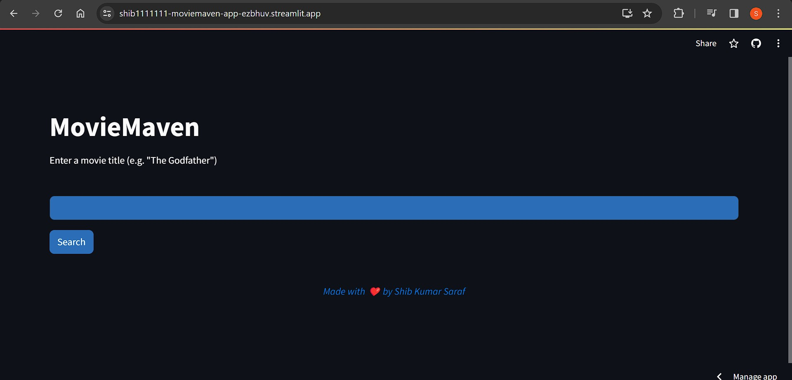
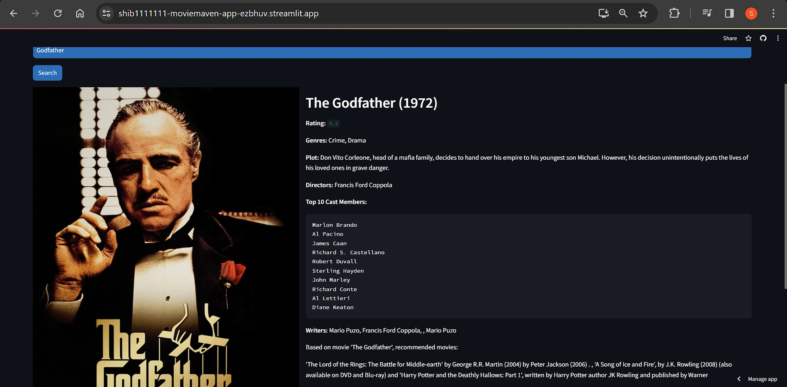

# MovieMaven

MovieMaven is a Streamlit app that allows users to search for movies by title and explore various details about them, such as rating, genres, plot, directors, cast, writers, production companies, box office gross, budget, and recommendations. The app utilizes the IMDbPy library to search for movies and retrieve their details.

## Features

- **Search Movies:** Users can enter a movie title in the input field and click the "Search" button to retrieve details about the movie.
- **Display Movie Details:** The app displays comprehensive details about the searched movie, including an image, title, year, rating, genres, plot, directors, cast, writers, recommendations and more.
  
- **Display Movie Recommendations:** The app generates movie recommendations using a GPT-2 language model based on the input movie's title. Users can explore suggested movies related to their search.
  
- **Custom Styling:** The user interface is styled using custom CSS to enhance the visual experience.

## Screenshots


<table align="center">
  <tr>
    <td></td>
  </tr>
  <tr>
    <td><em>Home Page</em></td>
  </tr>
</table>

<table align="center">
  <tr>
    <td></td>
  </tr>
  <tr>
    <td><em>Home Page with outputs </em></td>
  </tr>
</table>


## Getting Started

Before you can run the MovieMaven app, ensure that you have the necessary prerequisites installed on your machine.

### Prerequisites

Make sure you have the following installed:

- [Python 3.x](https://www.python.org/downloads/): The programming language used to run the app.
- [IMDbPy library](https://imdbpy.github.io/): A Python wrapper for the IMDb API.
- [Streamlit](https://streamlit.io/): A Python library for creating web applications.
- [Transformers library](https://huggingface.co/transformers/): A library for state-of-the-art natural language processing models.

### Installation

Follow these steps to set up the MovieMaven app on your local machine: 

1. **Clone the Repository:**

   Open your terminal and run the following commands:

   ```bash
   git clone https://github.com/shib1111111/MovieMaven.git
   cd MovieMaven

   ```

2. **Install Dependencies:**

Run the following command to install the required dependencies:

```bash
pip install -r requirements.txt
  ```

## Usage
To run the MovieMaven app, execute the following command in your terminal:
```bash
streamlit run app.py  
```
Visit the provided local URL (usually http://localhost:8501) in your web browser to access the app. You can now search for movies and explore their details.

or directly go to deployed server url : https://shib1111111-moviemaven-app-ezbhuv.streamlit.app/


## Contributing

We welcome contributions to enhance MovieMaven. Feel free to open issues or submit pull requests.

## License

This project is licensed under the [MIT License](LICENSE).

Thank you for using MovieMaven! Feel free to reach out with any questions or feedback.

<em style="color: #ff66b2; font-weight: bold;">✨ --- Designed & made with Love by Shib Kumar Saraf ✨</em>
